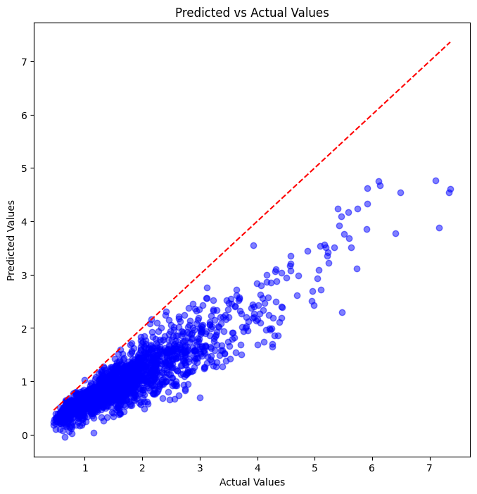
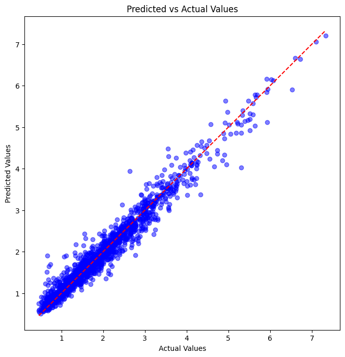

# AutoML Regression: Predicting Significant Wave Heights 🌊

## 📌 Project Objective
The purpose of this project is to use **BigQuery AutoML** to build a regression model that predicts **significant wave height** based on oceanographic data. This project includes steps for:
- Data ingestion and preparation
- Model training and evaluation
- Visualizing predictions against actual values
- Comparing results with manually created machine learning models

---

## 📊 Dataset Description
The dataset contains oceanographic measurements and wave data. The key features include:
- **Date and Time**: Timestamp of the measurement.
- **Average Current Speed (mps)**: Speed of ocean currents.
- **Current Direction**: Direction of the current flow.
- **Water Temperature (°C)**: Sea water temperature.
- **Salinity**: Salt concentration in water.
- **Mean and Peak Wave Period (s)**: Time between successive waves.
- **Wave Direction and Wind Speed**: Attributes related to wind and wave.

The target variable is:
- **Significant Wave Height (m)**: Height of the waves to be predicted.

---

## ⚙️ Tools and Technologies
- **Google Cloud BigQuery**: To train and evaluate the AutoML regression model.
- **Python**: For querying and analyzing predictions.
- **Pandas**: Data manipulation and handling.
- **Matplotlib**: For creating visualizations.

---

## 🛠️ Workflow
1. **Data Upload**: The training and test datasets are uploaded to **BigQuery**.
2. **Model Training**: The AutoML model is created using the `ML.CREATE_MODEL` function in BigQuery.
3. **Model Evaluation**: 
   - Metrics such as **Mean Absolute Error (MAE)**, **Mean Squared Error (MSE)**, and **R² score** are calculated using `ML.EVALUATE`.
4. **Model Prediction**:
   - Predictions are generated on the test dataset using `ML.PREDICT`.
5. **Visualization**:
   - A scatter plot of **Predicted vs Actual** values is created to assess the model's performance.
6. **Manual Model Comparison**:
   - Predictions from manually created machine learning models (e.g., Linear Regression) were compared with AutoML results.
   - The manually created models provided better R² scores, demonstrating that manual tuning and feature engineering can outperform AutoML in this case.

---

## 📈 Results
### Model Evaluation Metrics:
| Metric                        | AutoML Value | Manual ML Value |
|-------------------------------|--------------|----------------|
| **Mean Absolute Error (MAE)** | 0.753781     | 0.189700       |
| **Mean Squared Error (MSE)**  | 0.798625     | 0.275200       |
| **R² Score**                  | 0.196255     | 0.952800       |

### Visualization:
The scatter plot below compares the predicted wave heights to the actual values. The first graph is the result of the AutoML and the second is from the XGBoost with hyperparameter tuning. The red dashed line represents the perfect prediction line:




---

## 🔍 Observations
- The AutoML model shows signs of **underfitting**, particularly for higher actual wave heights.
- Manual machine learning models performed better, achieving a higher R² score and better alignment with the actual values.
- This highlights the importance of **manual feature engineering** and **model tuning** when AutoML does not fully capture the complexity of the data.

### Recommendations for Improvement:
1. Incorporate additional relevant features into the dataset.
2. Increase the training budget or explore alternative modeling approaches.
3. Perform manual tuning of hyperparameters to optimize performance.
4. Continue improving feature selection and engineering for both manual and AutoML models.

---

## 📝 Files
```
|-- G13.ipynb               # Jupyter Notebook with the entire pipeline
|-- scatter.png             # Visualization of predictions
|-- XGB.png                 # Visualization of predictions
|-- README.md               # Project documentation
```

---

## 🚀 How to Run
1. **Set up Google Cloud Project**:
   - Enable **BigQuery API**.
   - Upload the dataset to BigQuery tables.

2. **Run the Jupyter Notebook**:
   - Install required libraries:
     ```bash
     pip install google-cloud-bigquery pandas matplotlib
     ```
   - Authenticate with Google Cloud credentials:
     ```bash
     export GOOGLE_APPLICATION_CREDENTIALS="path/to/your/service-account.json"
     ```
   - Run the notebook to train, evaluate, and visualize the predictions.

3. **View Results**:
   - Check the evaluation metrics.
   - Compare AutoML results with manually created ML models.
   - Analyze the scatter plot to assess model predictions.

---

## 🤝 Acknowledgments
- **Google Cloud Platform** for AutoML features.
- **Matplotlib** and **Pandas** for data visualization and handling.
- Real-world oceanographic data sources for the dataset.
- Manual machine learning modeling techniques for comparison.

---

## 🌟 Author
Developed by [DanteSc03](https://github.com/DanteSc03). Feel free to contribute or share feedback! 🚀
